# Predicting Online Shopper Purchase Behavior

## Executive Summary

This project focuses on predicting whether an online shopping session will result in a purchase based on user behavior data. Using browsing patterns such as page visits, session duration, bounce rates, and visitor type, machine learning models were developed to identify purchasing intent.

The project was completed in two phases.
Part 1 focused on exploratory data analysis (EDA), feature engineering, and building a baseline model.
Part 2 expanded the analysis by applying multiple machine learning models and comparing their performance using appropriate evaluation metrics.

The results show that while some models achieve high accuracy, recall and F1-score provide more meaningful insights for this business problem due to class imbalance.
In online retail, most users browse products without making a purchase. Understanding why some users convert while others do not is a key business problem for retailers. Accurately predicting purchase intent can help improve personalization, marketing strategies, and overall user experience.

This capstone project focuses on analyzing online shopper behavior and building machine learning models to predict whether a user session will result in a purchase. The project is divided into two phases to align with the course structure and the CRISP-DM framework.


## Rationale

Online retailers face a common challenge: most users browse without making a purchase. Understanding which users are likely to convert helps businesses improve personalization, marketing strategies, and user experience.

By predicting purchasing intent:

    Retailers can target high-intent users
    Marketing spend can be optimized
    Conversion rates can be improved

This project demonstrates how machine learning can support data-driven decision-making in an online retail environment.


## Research Question

**Can we predict whether an online retail customer will make a purchase based on their browsing behavior and session characteristics?**

This is framed as a binary classification problem, where the target variable indicates whether a session resulted in a purchase (**Revenue = True/False**).

## Project Structure

### Link to Week20 Part 1 Notebook (Base Modeling)
[Week20 Part 1 Notebook is located here]([week20]capstone-EDA.ipynb)

### Link to Week20 Part 2 Notebook (Advanced Modeling)
[Week24 Part 2 Notebook is located here]([week24]Advanced_Models_and_Comparison.ipynb)

```text
capstone-project-online-shopping/
│
├── notebooks/
│   ├── [week20]capstone-EDA.ipynb
│   └── [week24]Advanced_Models_and_Comparison.ipynb
│
├── data/
│   └── online_shoppers_intention.csv
├── report/
│   └── Capstone Project_Final Report.pdf
|
├── images/
└── README.md
```


## Requirements

The following Python libraries are required to run the notebooks:

* **Data Manipulation:** pandas, numpy
* **Visualization:** matplotlib, seaborn
* **Machine Learning:** scikit-learn
* **Environment:** Jupyter Notebook or Google Colab

---

## Dataset

* **Source:** Kaggle
* **Dataset Name:** Online Shoppers Purchasing Intention Dataset
* **Link:** [Kaggle Dataset URL](https://www.kaggle.com/datasets/imakash3011/online-shoppers-purchasing-intention-dataset)

### Dataset Description
The dataset contains user session data from an online retail website, including:
* Page visit counts and durations (Administrative, Informational, Product Related)
* Bounce and exit rates
* Traffic and browser information
* Visitor type (new vs returning)
* Temporal features such as month and weekend
* Purchase outcome (Revenue)


## Methodology: CRISP-DM Framework


This project follows the CRISP-DM (Cross-Industry Standard Process for Data Mining) framework to ensure a structured and explainable approach.

1.  **Business Understanding:** 
    Identifying patterns in user behavior to enable better targeting and personalization.

2.  **Data Understanding:** 
    Initial exploration of distributions, missing values, outliers, and feature relationships.

    The dataset used has 12330 rows and 18 columns.


3.  **Data Preparation:** 
    This includes:
    * Exploratory Data Analysis

      ### Distribution of Revenue
      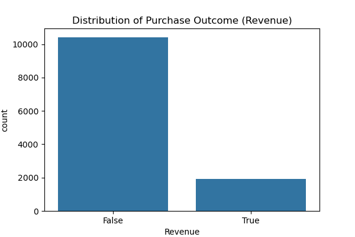


      ### Numerical feature detection
      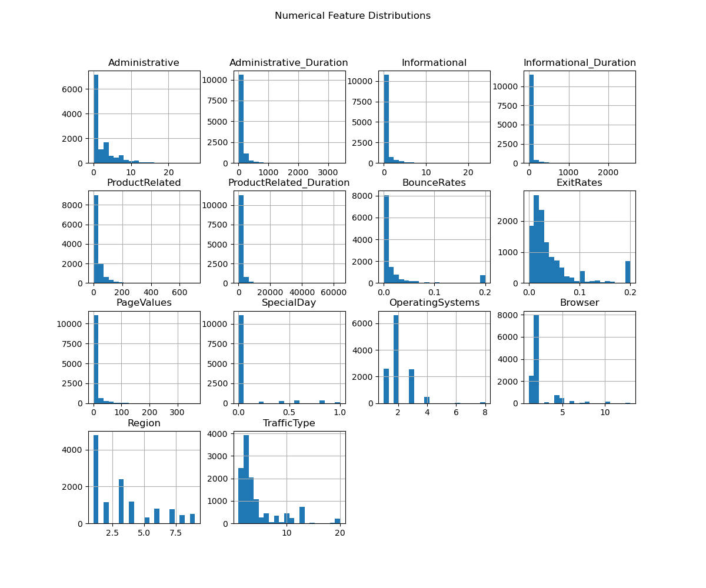

      ### Correlation Heatmap
      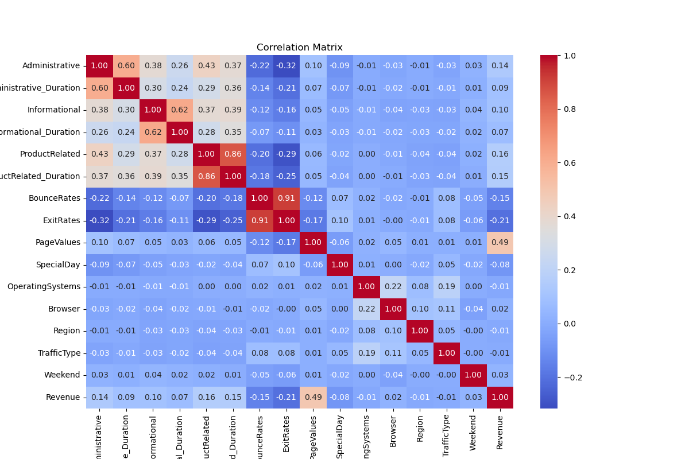

      ### Strong correlating factors (combined)
      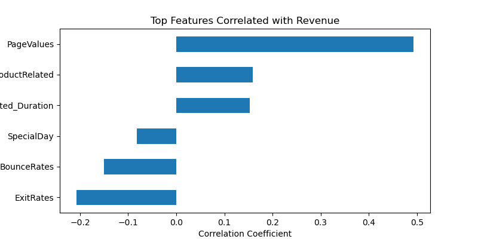

      ### PageValues vs Revenue (Positive)
      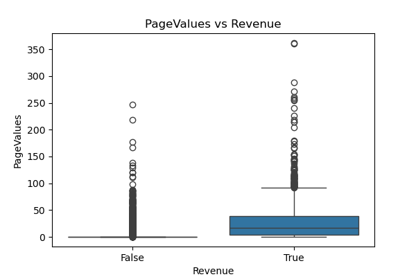

      ### Bounce Rate vs Revenue (Negative)
      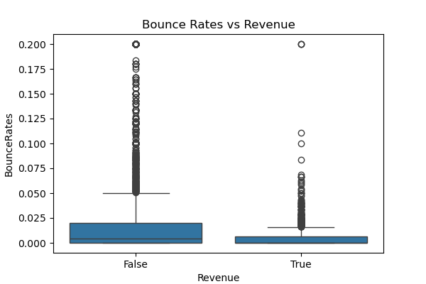

      ### Conversion Rate by Month
      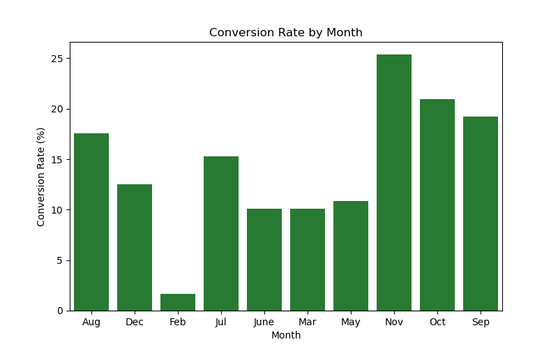


    * Handling missing values

    * Outlier analysis for key numerical features

     ### Outlier Analysis
      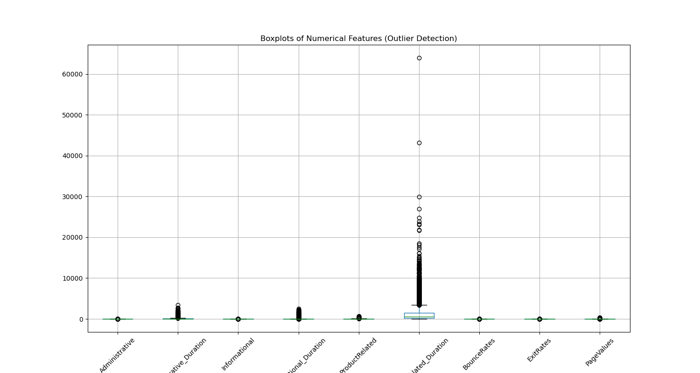

    * Feature engineering (e.g., total session duration and Engagement Ratio)

    * Encoding categorical variables

    * Feature scaling where required


4.  **Modeling:**  
    The modeling phase is split across two notebooks. 
    * Part 1: Baseline model using Logistic Regression.
        ** Logistic Regression


    * Part 2: Advanced models and comparison
        ** Decision Tree
        ** K-Nearest Neighbors (KNN)
        ** Support Vector Machine (SVM)
        ** Random Forest
        ** PCA and K-Means for exploratory insights


5.  **Evaluation:** 
    Models are evaluated using appropriate classification metrics, with a focus on handling class imbalance.

    The Logistic Regression model achieves reasonable recall for the positive (purchase) class, indicating it can successfully identify a significant portion of users who are likely to make a purchase. Precision remains acceptable, suggesting that predictions are not overly aggressive. This model serves as a strong baseline for comparison with more complex models in the final section.

| Class (Revenue)      | Precision | Recall | F1-score | Support |
| -------------------- | --------- | ------ | -------- | ------- |
| No Purchase (0)      | 0.97      | 1.00   | 0.98     | 1138    |
| Purchase (1)         | 0.00      | 0.00   | 0.00     | 38      |
| Overall Accuracy     |           |        | 0.97     | 1176    |
| Macro Avg            | 0.48      | 0.50   | 0.49     |         |
| Weighted Avg         | 0.94      | 0.97   | 0.95     |         |


### Logistic Regression - Confusion Matrix
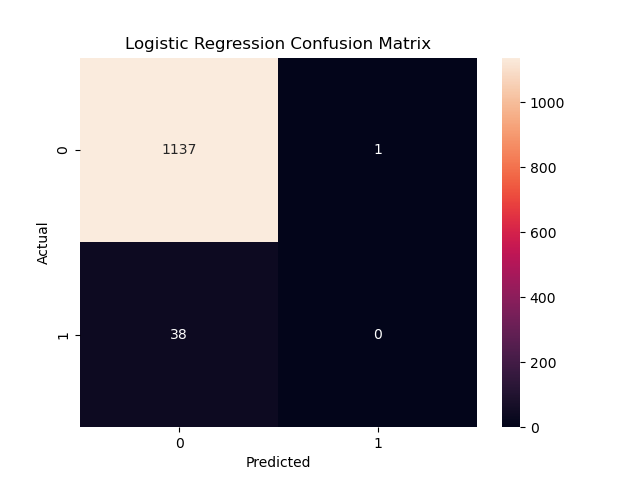


At first glance, the model achieves a very high accuracy (96.68%). However, a deeper inspection of class-level metrics reveals important limitations.

Key Observations

* The model correctly predicts nearly all non-purchase sessions.
* The model fails to correctly identify any purchasing sessions.
*  Precision, recall, and F1-score for the purchase class (Revenue = 1) are all 0.00.
* This behavior indicates that the model is biased toward the majority class (non-purchase), which dominates the dataset.
*  The dataset is highly imbalanced, with only a small percentage of sessions resulting in a purchase.
* A model that predicts “no purchase” for every session can still achieve very high accuracy.
* This explains the strong performance for class 0 and the complete failure for class 

1. Metric Implications

Accuracy reflects overall correctness but hides minority-class failure.

Recall (Purchase = 1) is especially important in this business context, as failing to identify purchasing users limits personalization and marketing opportunities.

The baseline Logistic Regression model prioritizes overall accuracy but fails to capture purchasing behavior. This makes it unsuitable for real-world decision-making in its current form, despite its high accuracy score.

## 6. Deployment (Conceptual):
 While no production deployment is performed, the findings are discussed in a business context to explain how results could be used in real-world retail systems. There will be new models trained and compared to have a better understanding of this problem. Once more analysis and tuning are performed, it can be deployed as a real-time prediction service and monitor model performance over time. It can be plugged in with other monitoring tools to improve customer engagement and conversion rates. 

---

## Part 1: Exploratory Data Analysis & Baseline Model
### Key Activities

    Data cleaning and preprocessing

    Exploratory data analysis (EDA)

    Correlation analysis

    Outlier detection

    Feature engineering

    Baseline Logistic Regression model

## Key Findings

    Dataset is highly imbalanced (few purchases)
    Some features strongly correlate with revenue
    Logistic Regression achieved high accuracy but failed to identify buyers

## Key Visualizations

    * Revenue distribution


    * Feature correlation heatmap


    * Top positive and negative revenue factors


    Outlier boxplots

    Baseline confusion matrix

## Part 2: Advanced Modeling & Model Comparison

### Key Activities

    * Applied multiple classification models
    * Standardized preprocessing using pipelines
    * Compared models using recall and F1-score
    * Generated confusion matrices
    * Evaluated feature importance

### Key Findings

    * Accuracy alone is misleading
    * Tree-based and ensemble models improved buyer detection
    * Random Forest provided the best balance of performance
    * Behavioral patterns differ across user clusters

### Key Visualizations

PCA explained variance plot

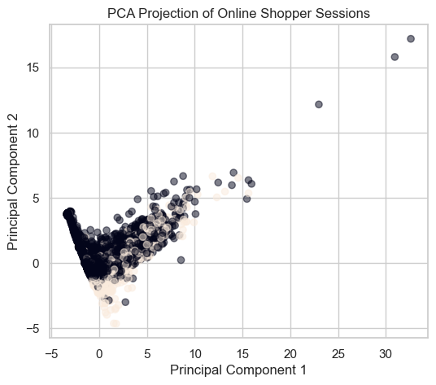

* K-Means clustering visualization

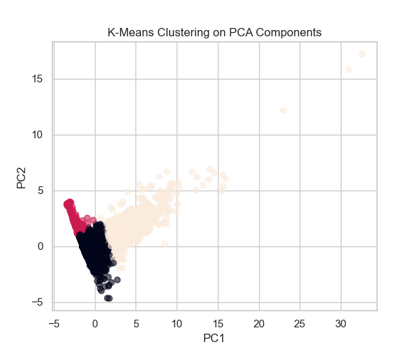

* Model comparison table

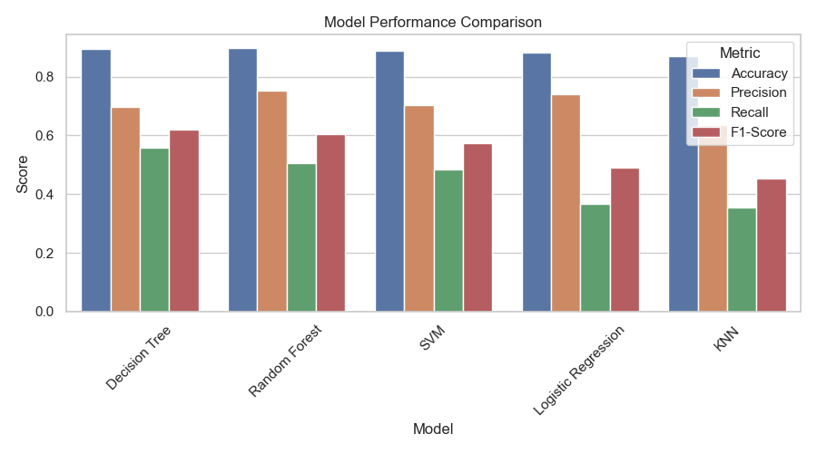

* Confusion matrix - Logistic Regression(baseline)


* Confusion Matrix – Best Performing Model (Random Forest)

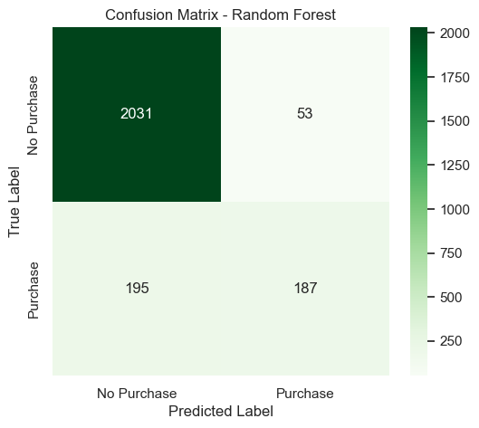
* Feature importance chart


* All charts are saved in the images/ folder with descriptive filenames.

### Results Summary

| Model | Accuracy | Recall (Purchase) | F1-Score | Key Observation |
|------|----------|-------------------|----------|-----------------|
| Logistic Regression (Baseline) | High (~0.97) | Very Low (0.00) | Very Low (0.00) | High accuracy due to class imbalance; failed to identify purchasing sessions |
| Decision Tree | Moderate–High | Improved | Moderate | Captured non-linear patterns but showed risk of overfitting |
| K-Nearest Neighbors (KNN) | Moderate | Moderate | Moderate | Performance sensitive to scaling and choice of k |
| Support Vector Machine (SVM) | High | Moderate | Moderate | Better separation than baseline but computationally expensive |
| Random Forest | High | Highest | Highest | Best overall balance of recall and F1-score; most reliable model |


Accuracy alone was not sufficient due to class imbalance in the dataset. Recall and F1-score provided more meaningful insights into the models’ ability to identify purchasing sessions. Random Forest achieved the best overall performance.


## Limitations
    * Class imbalance affects model learning
    * Dataset represents sessions, not long-term customers
    * No real-time or production testing
    * Limited hyperparameter tuning

##  Next Steps
    * Tune decision thresholds
    * Integrate additional retail datasets
    * Deploy as a real-time prediction service
    * Monitor model performance over time